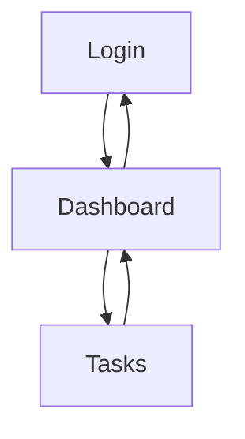

## 1. Product Overview
รีดีไซน์ UI หน้า Dashboard เพื่อให้จัดวางดีขึ้น อ่านง่ายขึ้น และ responsive มากขึ้น โดย “ไม่เปลี่ยนแปลงข้อมูล/ตรรกะ/API เดิม”
กลุ่มเป้าหมายคือผู้ใช้ที่ล็อกอินแล้ว (เดโม role: admin) ที่ต้องการดูสถานะ session และสรุปงานอย่างรวดเร็ว

## 2. Core Features

### 2.1 User Roles
| Role | Registration Method | Core Permissions |
|------|---------------------|------------------|
| ผู้ใช้ที่ลงชื่อเข้าใช้ | ล็อกอินผ่านหน้า Login (mock cookie auth) | เข้าถึงหน้า Dashboard/Tasks และเรียกดูข้อมูลของตนเอง |

### 2.2 Feature Module
ความต้องการของโปรดักต์ (ขอบเขตงานรีดีไซน์) มีหน้าหลักดังนี้:
1. **Dashboard**: หัวหน้า/แอคชัน, การ์ดสรุป Task, การ์ด Session, การ์ด Architecture, การ์ด Quick Actions, สถานะโหลด/ผิดพลาด, การจัดวาง/ตัวอักษร/ระยะห่าง/ความสม่ำเสมอ/Responsive (In-scope)
2. **Tasks**: หน้าจัดการงาน (คงเดิม, Out-of-scope)
3. **Login**: หน้าล็อกอิน/รีล็อกอิน (คงเดิม, Out-of-scope)

### 2.3 Page Details
| Page Name | Module Name | Feature description |
|-----------|-------------|---------------------|
| Dashboard | Layout System | จัดวางหน้าแบบ “header + bento grid (12 คอลัมน์)” โดยใช้ spacing scale เดียวกันทั้งหน้า และกำหนด max-width/center ให้คอนเทนต์เพื่อไม่ให้โล่งเกินไปบนจอใหญ่ |
| Dashboard | Typography & Hierarchy | ปรับลำดับตัวอักษร: H1/Subtitle/Section title/Body/Meta ให้ชัดเจน (ขนาด/น้ำหนัก/สี) และใช้รูปแบบตัวเลข (counts) ที่สม่ำเสมอ |
| Dashboard | Header Actions | แสดงชื่อหน้า/คำอธิบายสั้น + ปุ่ม “Open Tasks” และ “Refresh” ในตำแหน่งที่สม่ำเสมอ พร้อมสถานะ loading บนปุ่ม Refresh |
| Dashboard | Session Card | แสดงผู้ใช้ที่ลงชื่อเข้าใช้ (ชื่อ, อีเมล, role) พร้อมปุ่ม “View Login” เพื่อไปหน้า Login (ลิงก์เดิม) |
| Dashboard | Task Summary Card | แสดงตัวเลข Total/Done/Doing/Todo โดยคงการคำนวณและข้อมูลเดิม แต่ปรับการ์ดให้สัดส่วน/ระยะห่าง/พื้นหลัง/เส้นขอบ/ตัวเลข อ่านง่ายขึ้น |
| Dashboard | Architecture Card | แสดง bullet/label ของ UI/State/Service/API (ข้อความเดิม) แต่ปรับความอ่านง่าย (line-height, gap, badge alignment) |
| Dashboard | Quick Actions Card | แสดงปุ่มลัด “Manage Tasks” และ “Re-Login” (ลิงก์เดิม) โดยจัดเป็นแนวนอนบนเดสก์ท็อป และสลับเป็นแนวตั้งบนจอเล็ก |
| Dashboard | Background & Visual Consistency | คงคอนเซ็ปต์ liquid glass แต่ทำให้ “ไม่แย่งความสนใจ”: ลดความแรงของ blur/opacity ตาม breakpoint และทำให้การ์ดทุกใบมีสไตล์เดียวกัน (radius, border, shadow, backdrop) |
| Dashboard | Responsive Behavior | ปรับ grid: มือถือเป็น 1 คอลัมน์, แท็บเล็ตเป็น 2–6 ส่วน, เดสก์ท็อปเป็น 12 คอลัมน์ พร้อมกำหนด min-height ของการ์ดเพื่อไม่ให้กระโดดเมื่อข้อมูลโหลด |
| Dashboard | States & Empty/Error | แสดง skeleton/placeholder ในการ์ดสรุปเมื่อกำลังโหลด และแสดงข้อความ/ปุ่มทางเลือกเมื่อโหลดล้มเหลว (เช่น แนะนำ Refresh/ไป Login) โดยไม่เปลี่ยน flow เดิม |
| Tasks | UI | คง UI/ข้อมูล/พฤติกรรมเดิมทั้งหมด |
| Login | UI | คง UI/ข้อมูล/พฤติกรรมเดิมทั้งหมด |

## 3. Core Process
**User Flow (ผู้ใช้ที่ลงชื่อเข้าใช้)**
1. ผู้ใช้ล็อกอินที่หน้า Login → ระบบตั้ง session (mock cookie)
2. ผู้ใช้เข้าหน้า Dashboard → ระบบดึงข้อมูลผู้ใช้ (me) และดึงรายการ tasks (page=1, pageSize=20) ตามเดิม
3. ผู้ใช้กด Refresh → ระบบเรียกดึงรายการ tasks ใหม่ตาม pageSize ปัจจุบัน (เดิม)
4. ผู้ใช้กด Open Tasks/Manage Tasks → ไปหน้า Tasks (เดิม)
5. ผู้ใช้กด View Login/Re-Login → ไปหน้า Login (เดิม)

