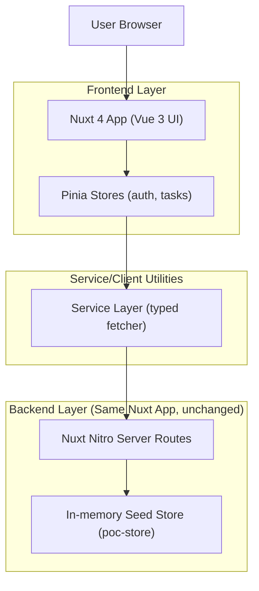
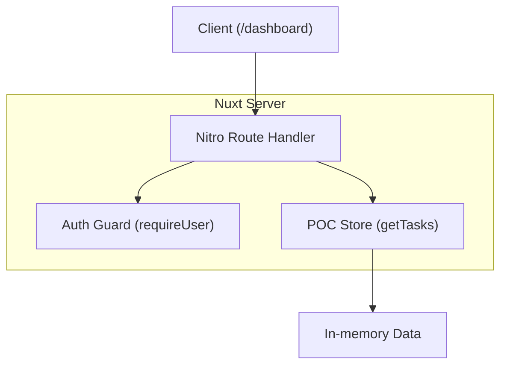

## 1.Architecture design


**ขอบเขตการเปลี่ยนแปลง (สำคัญ)**
- เปลี่ยนเฉพาะชั้น UI/สไตล์/เลย์เอาต์ของหน้า `/dashboard` (เช่น การจัดวาง bento grid, typography scale, spacing, responsive)
- ห้ามเปลี่ยน: โครงสร้างข้อมูล, Pinia store logic, service/repository, Nitro API routes, request/response shape, query params

## 2.Technology Description
- Frontend: Nuxt@4 (Vue@3) + Tailwindcss@3 + @pinia/nuxt + flowbite (ใช้เป็นชุด UI เสริมถ้ามีอยู่เดิม)
- Backend: Nuxt Nitro server routes (คงเดิม)
- Database: None (ใช้ in-memory seed ผ่าน `poc-store`, คงเดิม)

## 3.Route definitions
| Route | Purpose |
|-------|---------|
| /dashboard | หน้า Dashboard (รีดีไซน์ UI เท่านั้น, ต้องล็อกอิน) |
| /tasks | หน้าจัดการงาน (คงเดิม) |
| /login | หน้าเข้าสู่ระบบ/รีล็อกอิน (คงเดิม) |

## 4.API definitions (If it includes backend services)
> หมายเหตุ: ข้อมูลด้านล่างเป็น “ของเดิม” เพื่อยืนยันว่า UI redesign ไม่กระทบ API

### 4.1 Tasks
```
GET /api/tasks?page={number}&pageSize={number}&q={string?}&status={"todo"|"doing"|"done"?}
POST /api/tasks
PUT /api/tasks/{id}
DELETE /api/tasks/{id}
```

### 4.2 Auth (mock cookie auth)
```
POST /api/auth/login
POST /api/auth/logout
GET /api/auth/me
```

## 5.Server architecture diagram (If it includes backend services)


## 6.Data model(if applicable)
(คงเดิม — ไม่มีการเปลี่ยน schema หรือ type)
