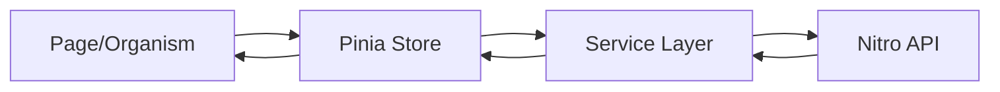
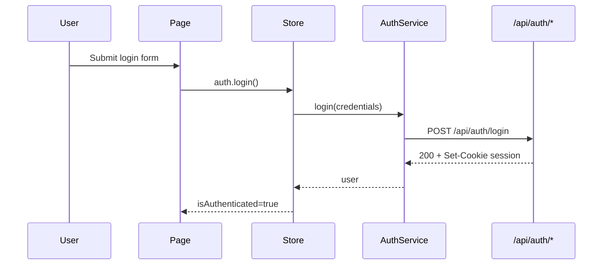

# POC - Vue 3 & Nuxt (Enterprise Architecture)

โปรเจกต์ Proof of Concept (POC) นี้จัดทำขึ้นเพื่อทดสอบและวางโครงสร้างพื้นฐานสำหรับการพัฒนาเว็บแอปพลิเคชันด้วย **Nuxt** และ **Vue 3 (Composition API)** โดยเน้นประสิทธิภาพ (Performance), ความยืดหยุ่น (Scalability) และการรองรับเทคโนโลยีฝั่ง Backend ที่หลากหลาย เช่น Laravel หรือ Node.js

## 🛠 Tech Stack & Tools
- **Framework:** [Nuxt](https://nuxt.com/) (POC นี้ใช้ Nuxt 4)
- **State Management:** [Pinia](https://pinia.vuejs.org/) (แทน Vuex)
- **Styling:** [Tailwind CSS](https://tailwindcss.com/) & [Flowbite](https://flowbite.com/)
- **Language:** TypeScript
- **Icons:** [Nuxt Icon](https://nuxt.com/modules/icon) (ใช้ `@nuxt/icon`)
- **Deployment Ready:** Docker Support & Cloud Native (AWS S3/Lambda ready)

## 🎯 POC Scope (สำหรับ GitHub Portfolio)
- Authentication แบบ mock แต่ใช้งานจริงด้วย cookie session (login/me/logout)
- Task Management (CRUD) + list/filter/pagination
- Enterprise conventions: Atomic Design, Pinia Setup Stores, Service Layer (Repository Pattern)
- Quality gates: TypeScript strict, Lint, Tests, CI, Docker

## 🏗 Project Structure
เน้นการแยกส่วน Logic และ UI ออกจากกันตามมาตรฐาน Senior Developer และ Enterprise Patterns:

```text
├── assets/              # Uncompiled assets (Sass, Images, Fonts)
├── components/          # UI Components (Atomic Design)
│   ├── atoms/           # Smallest components (Buttons, Inputs, Icons)
│   ├── molecules/       # Groups of atoms (Form groups, Cards)
│   └── organisms/       # Complex sections (Header, Footer, Tables)
├── composables/         # Reusable Composition API logic (useAuth, useFetch)
├── constants/           # Global constants & Configuration values
├── layouts/             # Page Layouts (Default, Auth, Dashboard)
├── middleware/          # Route Guards & Auth Logic
├── pages/               # Application Routes (File-based Routing)
├── plugins/             # External Library Integrations (Axios, Analytics)
├── public/              # Static assets (Favicon, Robots.txt) served as-is
├── server/              # Server-side API Routes (Nitro Engine)
├── services/            # API Service Layer (Repository Pattern) - Decoupled from UI
├── stores/              # Pinia State Management (Global State)
├── tests/               # Testing (Unit & E2E)
├── types/               # TypeScript Interfaces/Types (DTOs, Models)
├── utils/               # Pure Helper Functions (Date formatting, Validation)
└── nuxt.config.ts       # Nuxt Configuration
```

## 📐 Architecture Guidelines

## 🔁 Data Flow (Strict)
ทุก feature ต้องไหลตามโครงนี้เพื่อให้ testable/maintainable:



### 1. Component Design (Atomic)
- **Atoms**: Stateless, reusable, single responsibility.
- **Molecules**: Combinations of atoms, usually stateless.
- **Organisms**: Complex UI parts, can communicate with stores/services.

### 2. State Management (Pinia)
- Use **Setup Stores** pattern for better TypeScript support.
- Keep business logic inside Stores or Composables, not in Components.

### 3. API Layer (Services)
- All API calls should be encapsulated in `services/`.
- Components call Stores -> Stores call Services -> Services call API.
- Do not call `useFetch` or `$fetch` directly in components for complex logic.

## 🔐 Auth Flow (Mock Session Cookie)



## ✅ Definition of Done (สำหรับทุก PR/Feature)
- มี types ครบ (DTO/Model)
- UI ใช้ atomic components เท่าที่เหมาะสม
- store/service แยกชัด และไม่มี API call ใน component
- มี error/loading/empty states
- ผ่าน lint/typecheck/test/build
